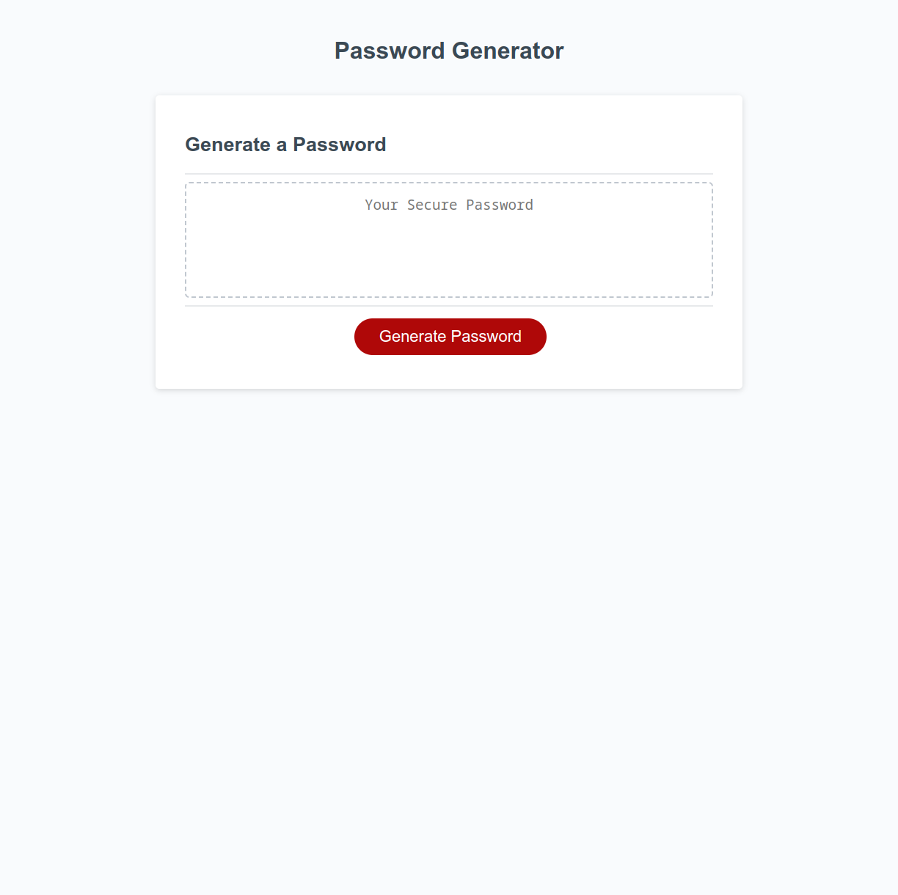

# wk3c-secure-password-generator

## Description

The client has access to sensitive data and requested their web page be completed with the necessary JavaScript to randomly generate a password that meets certain criteria to provide greater security. I used a random number generator to generate numbers within the range of the UTF-8 basic latin decimal character codes. I added code to validate that the numbers generated matched the user specified criteria and regenerate the random numbers if it did not validate.

I went through a few iterations of generating the password, including looking into the more cryptically secure Crypto.getRandomValues() method, but in the end decided that the time to value ratio for me to implement it to my liking would be better spent extensively testing my code before deployment. That method is definitely something that I will look into more depth in the future for similar projects.

## Installation

N/A

## Usage

Click the button on the web page to start the process to generate a random password between 8 and 128 characters. The user will be prompted to input the password length and what time of characters to use. At least one of the four character types (lowercase, uppercase, numeric, and special characters) must be selected by the user to proceed. The JavaScript will then produce a randomly generated password of the specified length and using at least one of each character type the user selected.

Deployed page link: https://josht-dev.github.io/wk3c-secure-password-generator/

## Credits

Original code provided by client here: https://github.com/coding-boot-camp/friendly-parakeet

## License

Refer to the LICENSE in the repo for the code